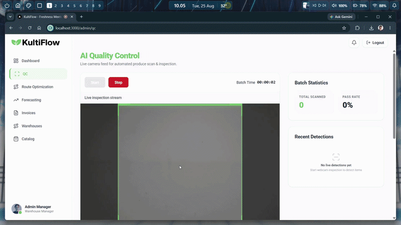
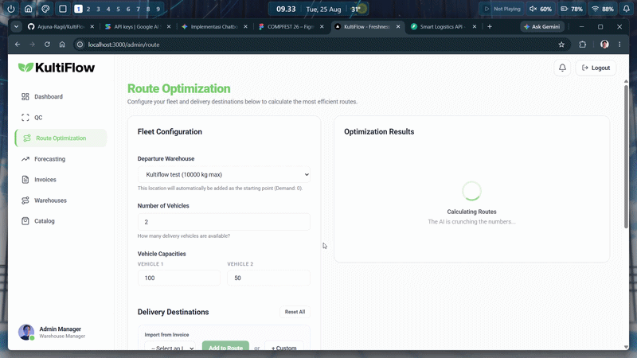
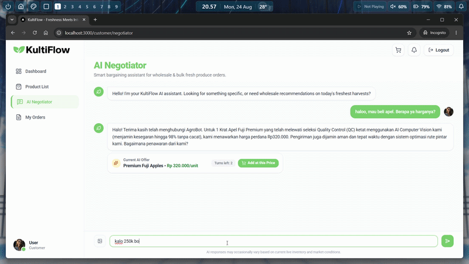
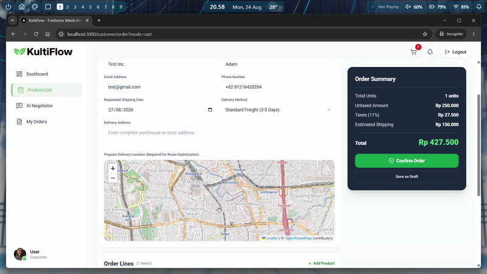
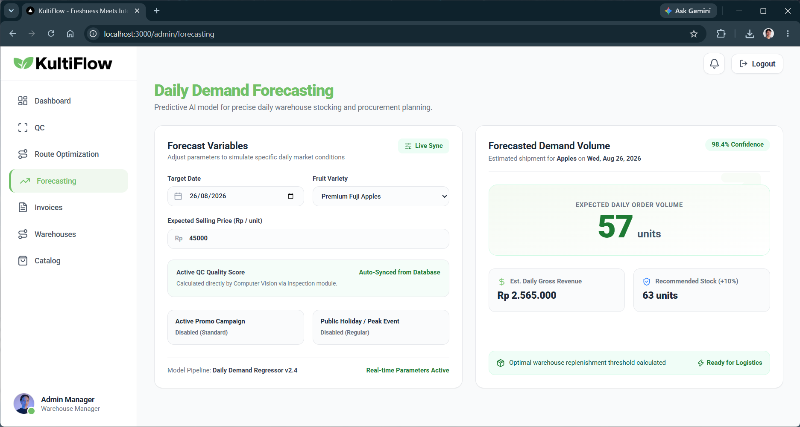

# KultiFlow

KultiFlow is an end-to-end, AI-powered Supply Chain Management (SCM) system designed specifically for the agricultural and fruit distribution industry. It provides a comprehensive suite of tools to manage manufacturing quality, optimize logistics routing, forecast sales demands, and automate commercial negotiations.

## System Architecture

The project is built on a modern microservices architecture, orchestrated via Docker Compose. It is split into three main layers:

1. **Frontend UI**: A Next.js web application providing the administrative dashboard.
2. **Server Gateway**: A central FastAPI application that manages the PostgreSQL database, handles core business logic (invoices, warehouses), and routes traffic to the AI microservices.
3. **AI Microservices**: Five independent FastAPI services, each dedicated to a specific AI or heavy-compute task.

## Codebase Breakdown

### 1. Frontend (`/ui`)
- **Tech Stack**: Next.js (React 19), Tailwind CSS v4, Recharts (for data visualization), Leaflet (for interactive routing maps).
- **Purpose**: Provides the user interface for warehouse managers to view invoices, configure delivery routes, check quality control statuses, and review sales forecasts.

### 2. Backend Gateway (`/server`)
- **Tech Stack**: FastAPI, SQLAlchemy (asyncpg), PostgreSQL.
- **Purpose**: Acts as the central orchestrator. It manages database connections, provides CRUD endpoints for core entities (Invoices, Warehouses), and proxies specialized requests to the downstream AI microservices.

### 3. AI Microservices (`/ai-services`)
Each service runs in its own Docker container and exposes a dedicated API port.

- **Quality Control (`/qc` - Port 8001)**
  - Processes manufacturing and fruit quality inspection. Uses computer vision libraries (TensorFlow, ONNX Runtime, Rembg, Pillow) to detect defects or determine the grade of the agricultural products.
  
  

- **Route Optimization (`/route` - Port 8002)**
  - Handles logistics and delivery dispatching.
  - Combines Google's OR-Tools for solving the Vehicle Routing Problem (VRP) with time windows and capacities, OSRM for real-world distance matrices, and the Gemini AI API to generate human-readable dispatcher instructions.
  
  

- **Negotiation (`/nego` - Port 8003)**
  - An automated commerce module utilizing the Gemini AI API to handle intelligent negotiations for procurement or bulk sales.
  
  

- **Anomaly Detection (`/anomaly` - Port 8004)**
  - Uses Pandas and PyDantic to analyze invoice and manufacturing data streams to flag anomalies, fraud, or supply chain irregularities.
  
  

- **Sales & Demand Forecasting (`/sales-demand forecasting` - Port 8005)**
  - A machine learning service built with Scikit-Learn and Pandas. It analyzes historical sales data to predict future demand, helping warehouses optimize their stock levels.
  
  

## Getting Started

### Prerequisites
- Docker and Docker Compose
- A Google Gemini API Key

### Installation & Setup

1. **Configure Environment Variables**
   Create a `.env` file in the root directory of the project and add your Gemini API key:
   ```env
   GEMINI_API_KEY=your_api_key_here
   ```

2. **Build and Run the Containers**
   Start the entire microservices cluster using Docker Compose:
   ```bash
   docker compose up -d --build
   ```

3. **Access the Application**
   - **Web Dashboard**: http://localhost:3000
   - **Main API Swagger Docs**: http://localhost:8000/docs
   - **Database**: Exposed on port `5432` (Credentials defined in `compose.yml`).

## Troubleshooting

- **503 Service Unavailable on AI endpoints**: This typically occurs if an AI microservice (like `route` or `nego`) fails to start or times out. Ensure your `GEMINI_API_KEY` is valid, as rate limits or Google API outages can cause the Python SDK to hang during retries, leading to a gateway timeout.
